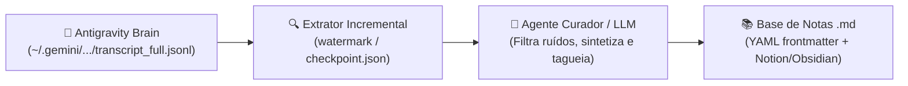

# chats2notes 🧠 ➡️ 📝

> Automação para extração incremental e curadoria inteligente de notas a partir dos históricos de conversas do Antigravity CLI.

Transforme conversas, tutoriais, arquiteturas e soluções técnicas discutidas com agentes de IA em uma base de conhecimento organizada em Markdown (compatível com **Notion**, **Obsidian**, **Logseq** e **Git Wikis**), sem precisar copiar e colar nada manualmente durante o desenvolvimento.

---

## 🎯 O Problema

Durante sessões de pair-programming com agentes de IA:
1. Muitas respostas contêm conceitos, códigos de referência e soluções valiosas.
2. Copiar e colar manualmente trechos no Notion ou bloco de notas quebra o ritmo de trabalho e consome tempo escasso.
3. As conversas não processadas viram uma "bola de neve" esquecida no histórico.

Como o Antigravity já persiste todo o histórico das sessões em logs estruturados (`transcript_full.jsonl`), o **chats2notes** aproveita essa fonte de verdade para extrair e curar o conhecimento automaticamente em segundo plano.

---

## 🏗️ Arquitetura

O sistema opera no padrão **Extrator Incremental ➡️ Curador Inteligente ➡️ Base de Notas**:



### Componentes Principais

1. **Extrator Incremental (`Extractor`)**:
   - Monitora as sessões em `~/.gemini/antigravity-cli/brain/<conversation-id>/`.
   - Lê os arquivos `transcript_full.jsonl` preservando a integridade das mensagens.
   - Utiliza um arquivo `checkpoint.json` para rastrear o último `step_index` ou timestamp de cada conversa, evitando reprocessamento e duplicações.

2. **Filtro & Curador Inteligente (`Curator`)**:
   - Descarta ruídos operacionais (ex: *"rode o comando X"*, correções de digitação, checagens rotineiras).
   - Identifica interações de alto valor (arquiteturas, explicações conceituais, snippets reutilizáveis, tutoriais).
   - Gera notas concisas e semânticas com metadados estruturados.

3. **Gerador de Notas (`Markdown Generator`)**:
   - Cria arquivos `.md` individuais com YAML frontmatter (`title`, `date`, `tags`, `source_session`, `category`).
   - Formatação limpa, pronta para busca textual ou sincronização externa.

4. **Automação / Agendamento**:
   - Execução programada (ex: cron diário às 00:00).
   - Execução manual / sob demanda via CLI.

---

## 📁 Formato de Nota Gerada (Exemplo)

```markdown
---
title: "Padrão de Extração Incremental com Checkpoint"
date: "2026-09-22 23:55:00"
tags: [arquitetura, antigravity, python, automacao]
category: "Engenharia de Software"
source_conversation: "b96f7f5a-6c4f-4bc4-814a-d1e5283cfc33"
---

## Resumo Executivo
Explicação do funcionamento do watermark tracking para processamento incremental de logs JSONL.

## Conceito Principal
...

## Código de Referência
...
```

---

## 🚀 Estrutura do Repositório (Planejada)

```
chats2notes/
├── README.md
├── .gitignore
├── pyproject.toml / requirements.txt
├── config/
│   └── default_config.yaml
├── src/
│   ├── __init__.py
│   ├── cli.py              # Ponto de entrada CLI
│   ├── extractor.py        # Leitor de transcripts e checkpoints
│   ├── curator.py          # Lógica de curadoria e síntese com LLM
│   ├── storage.py          # Escrita e organização das notas em Markdown
│   └── state.py            # Gerenciamento do checkpoint.json
└── tests/
    └── test_extractor.py
```

---

## 📄 Licença

MIT
