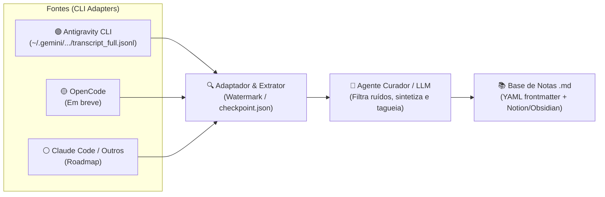

# chats2notes 🧠 ➡️ 📝

> Automação para extração incremental e curadoria inteligente de notas a partir dos históricos de conversas de Agentes de Pair-Programming via CLI (**Antigravity**, **OpenCode**, **Claude Code**, etc.).

Transforme conversas, tutoriais, arquiteturas e soluções técnicas discutidas com agentes de IA em uma base de conhecimento organizada em Markdown (compatível com **Notion**, **Obsidian**, **Logseq** e **Git Wikis**), sem precisar copiar e colar nada manualmente durante o desenvolvimento.

---

## 🎯 O Problema

Durante sessões de pair-programming com agentes de IA:
1. Muitas respostas contêm conceitos, códigos de referência e soluções valiosas.
2. Copiar e colar manualmente trechos no Notion ou bloco de notas quebra o ritmo de trabalho e consome tempo escasso.
3. As conversas não processadas viram uma "bola de neve" esquecida no histórico local de cada ferramenta.

Como os agentes de CLI persistem os históricos das sessões localmente (como o Antigravity em logs estruturados `transcript_full.jsonl`), o **chats2notes** aproveita essas fontes para extrair e curar o conhecimento automaticamente em segundo plano.

---

## 🏗️ Arquitetura

O sistema adota o padrão **Adaptador de CLI ➡️ Extrator Incremental ➡️ Curador Inteligente ➡️ Base de Notas**:



### Componentes Principais

1. **Adaptadores de CLI (`src/adapters/`)**:
   - Interface base padronizada (`BaseAdapter`) para descoberta de sessões e extração de turnos de diálogo.
   - **AntigravityAdapter**: Lê os arquivos `transcript_full.jsonl` preservando a integridade das mensagens e lidando com sessões sob `~/.gemini/antigravity-cli/brain/`.
   - **OpenCodeAdapter** *(próximo)*, **ClaudeCodeAdapter**, etc.

2. **Gerenciador de Estado Incremental (`src/state.py`)**:
   - Mantém o arquivo `checkpoint.json` rastreando a marca d'água (`last_processed_step` ou timestamp) por sessão e por adaptador, evitando reprocessamentos e duplicações.

3. **Filtro & Curador Inteligente (`src/curator.py`)**:
   - Descarta ruídos operacionais (ex: *"rode o comando X"*, correções de digitação, checagens rotineiras).
   - Identifica interações de alto valor (arquiteturas, explicações conceituais, snippets reutilizáveis, tutoriais).
   - Sintetiza notas concisas com metadados estruturados.

4. **Gerador de Notas (`src/storage.py`)**:
   - Cria arquivos `.md` com YAML frontmatter (`title`, `date`, `tags`, `source_agent`, `source_session`, `category`).
   - Formatação limpa, pronta para busca textual ou sincronização externa.

5. **Automação / Agendamento**:
   - Execução programada (ex: cron diário às 00:00).
   - Execução manual / sob demanda via CLI.

---

## 🗺️ Roadmap de Adaptadores

| Agente CLI | Status | Local de Armazenamento |
| :--- | :--- | :--- |
| **Antigravity CLI** | 🟢 Foco Atual (MVP) | `~/.gemini/antigravity-cli/brain/<uuid>/.../transcript_full.jsonl` |
| **OpenCode** | 🟡 Próximo | Sessões locais do OpenCode |
| **Claude Code** | ⚪ Planejado | Histórico de sessões do Claude Code |
| **Codex / Outros** | ⚪ Planejado | Sessões locais correspondentes |

---

## 📁 Formato de Nota Gerada (Exemplo)

```markdown
---
title: "Padrão de Extração Incremental com Checkpoint"
date: "2026-09-22 23:55:00"
source_agent: "antigravity"
source_session: "b96f7f5a-6c4f-4bc4-814a-d1e5283cfc33"
tags: [arquitetura, antigravity, python, automacao]
category: "Engenharia de Software"
---

## Resumo Executivo
Explicação do funcionamento do watermark tracking para processamento incremental de logs JSONL.

## Conceito Principal
...

## Código de Referência
...
```

---

## 🚀 Estrutura do Repositório (Planejada)

```
chats2notes/
├── README.md
├── .gitignore
├── pyproject.toml / requirements.txt
├── config/
│   └── default_config.yaml
├── src/
│   ├── __init__.py
│   ├── cli.py               # Ponto de entrada CLI
│   ├── state.py             # Gerenciamento do checkpoint.json
│   ├── curator.py           # Curadoria e síntese com LLM
│   ├── storage.py           # Escrita e organização das notas em Markdown
│   └── adapters/            # Camada extensível para múltiplos agentes de CLI
│       ├── __init__.py
│       ├── base.py          # Interface abstrata comum
│       ├── antigravity.py   # Adaptador Antigravity (logs JSONL em ~/.gemini)
│       └── opencode.py      # Adaptador OpenCode (próximo)
└── tests/
    ├── test_state.py
    └── test_antigravity_adapter.py
```

---

## 📄 Licença

MIT
