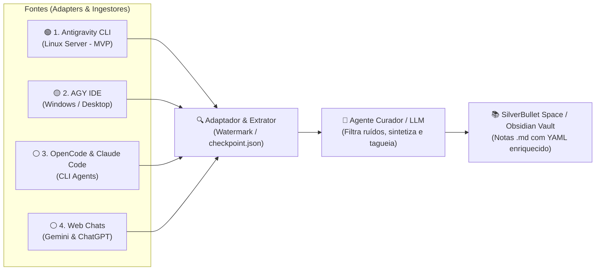

# chats2notes 🧠 ➡️ 📝

> Automação para extração incremental e curadoria de notas técnicas a partir de Agentes de Pair-Programming via CLI (**Antigravity**, **OpenCode**, **Claude Code**, etc.).
> 
> Projetado com foco de primeira classe para **[SilverBullet](https://silverbullet.md)** ([Self-Hosted](https://silverbullet.md) e [Desktop / Plus](https://silverbullet.plus)) e **[Obsidian](https://obsidian.md)**.

Transforme conversas, tutoriais, arquiteturas e soluções técnicas discutidas com agentes de IA em uma base de conhecimento organizada em Markdown, direto no seu *Space* do SilverBullet ou *Vault* do Obsidian, sem precisar copiar e colar nada manualmente durante o desenvolvimento.

---

## 🎯 O Problema

Durante sessões intensas de desenvolvimento com agentes de IA em linha de comando:
1. Muitas respostas contêm conceitos valiosos, discussões arquiteturais e snippets de referência.
2. Copiar e colar manualmente trechos quebra o fluxo de raciocínio e consome um tempo precioso.
3. As conversas não processadas acumulam-se em históricos esquecidos no disco.

Como os agentes de CLI persistem os históricos das sessões localmente (como o Antigravity em logs estruturados `transcript_full.jsonl`), o **chats2notes** atua em segundo plano: lê os logs de forma incremental, filtra ruídos e gera notas limpas prontas para estudo e consulta.

---

## 💎 Destinos de Primeira Classe: SilverBullet & Obsidian

O **chats2notes** prioriza a filosofia **local-first** e formatos abertos:

### ⚡ SilverBullet ([silverbullet.md](https://silverbullet.md) | [silverbullet.plus](https://silverbullet.plus))
O SilverBullet trata cada nota Markdown como um objeto consultável. O **chats2notes** gera notas formatadas especificamente para tirar proveito do motor de Live Queries:
* Compatível tanto com instâncias **Self-Hosted** (servidores Linux) quanto com a versão **Desktop / Plus** (Windows, Linux, macOS).
* Frontmatter enriquecido com atributos (`name`, `tags`, `agent`, `created`, `category`).
* Permite criar painéis dinâmicos no seu Space com consultas em tempo real:

```markdown
<!-- Exemplo de Live Query no SilverBullet -->
```query
page where tag = "ai-notes" and agent = "antigravity" order by created desc render [[Library/Core/Query/Table]]
```
```

### 🔮 Obsidian ([obsidian.md](https://obsidian.md))
* Estrutura 100% compatível com *Vaults* do Obsidian.
* YAML frontmatter padrão compatível com plugins como **Dataview**.
* Wikilinks (`[[Tópico Relacionado]]`) para tecer a rede de conhecimento bidirecional.

*(Também totalmente utilizável em Logseq, Notion e repositórios Git Wikis).*

---

## 🏗️ Arquitetura

O sistema adota o padrão **Adaptador de CLI ➡️ Extrator Incremental ➡️ Curador Inteligente ➡️ Base de Notas**:



### Componentes Principais

1. **Adaptadores de CLI & Ingestores (`src/adapters/`)**:
   - Interface base padronizada (`BaseAdapter`) para descoberta de sessões e leitura de turnos de diálogo.
   - **AntigravityAdapter**: Lê os arquivos `transcript_full.jsonl` preservando mensagens completas em `~/.gemini/antigravity-cli/brain/`.
   - **AgyIdeAdapter**: Localiza e consome as sessões da IDE no Windows/Linux.
   - **OpenCodeAdapter** e **ClaudeCodeAdapter**: Consome sessões locais de outros agentes CLI.
   - **WebChatAdapter**: Ingestão de exports ou chats de interfaces web (Gemini Web e ChatGPT).

2. **Gerenciador de Estado Incremental (`src/state.py`)**:
   - Mantém o arquivo `checkpoint.json` rastreando a marca d'água (`last_processed_step` ou timestamp) por sessão e adaptador, garantindo zero reprocessamentos ou duplicações.

3. **Filtro & Curador Inteligente (`src/curator.py`)**:
   - Descarta ruídos operacionais (comandos triviais, correções pontuais de sintaxe).
   - Identifica conhecimento de alto valor (arquiteturas, tutoriais, explicações conceituais).
   - Sintetiza notas concisas com metadados estruturados.

4. **Gerador de Notas (`src/storage.py`)**:
   - Escreve os arquivos `.md` no diretório do seu Space/Vault.
   - Suporte a tags, categorias e referências cruzadas.

5. **Multiplataforma por Padrão**:
   - Foco primário: **Servidores Linux** (onde residem os históricos de maior volume do Antigravity CLI).
   - Foco secundário: **Windows** (ambientes desktop com AGY IDE / SilverBullet Plus).
   - Manipulação de caminhos agnóstica via `pathlib.Path`.

---

## 🗺️ Roadmap de Prioridades e Fontes

| Nível / Prioridade | Fonte / Agente | Status | Descrição / Armazenamento |
| :--- | :--- | :--- | :--- |
| **1. Primário (MVP)** | **Antigravity CLI** | 🟢 Foco Atual | Servidor Linux (`~/.gemini/antigravity-cli/brain/`) |
| **2. Secundário** | **AGY IDE** | 🟡 Em seguida | Desktop Windows/Linux (Sessões e chats da IDE Antigravity) |
| **3. Terciário** | **OpenCode / Claude Code** | ⚪ Planejado | Sessões locais de outros agentes CLI de pair-programming |
| **4. Quaternário** | **Web Chats (Gemini & ChatGPT)** | ⚪ Exploração | Ingestão/processamento de exports ou extração de chats web |

---

## 📁 Formato de Nota Gerada (Exemplo)

```markdown
---
name: "Padrão de Extração Incremental com Checkpoint"
created: 2026-09-23 00:45:00
tags:
  - ai-notes
  - arquitetura
  - python
agent: antigravity
session: "b96f7f5a-6c4f-4bc4-814a-d1e5283cfc33"
category: "Engenharia de Software"
---

# Padrão de Extração Incremental com Checkpoint

## Resumo Executivo
Explicação do funcionamento do watermark tracking para processamento incremental de logs JSONL sem duplicar notas.

## Conceito Principal
...

## Código de Referência
...

## Sessão de Origem
- **Agente:** Antigravity CLI
- **Data:** 2026-09-23
