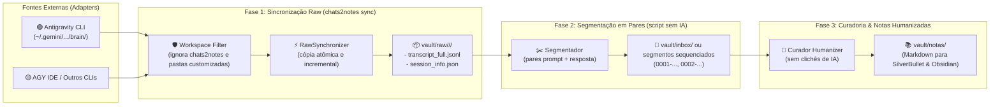

# chats2notes 🧠 ➡️ 📝

> Automação para extração incremental e curadoria de notas técnicas a partir de Agentes de Pair-Programming via CLI (**Antigravity**, **OpenCode**, **Claude Code**, etc.).
> 
> Projetado com foco de primeira classe para **[SilverBullet](https://silverbullet.md)** ([Self-Hosted](https://silverbullet.md) e [Desktop / Plus](https://silverbullet.plus)) e **[Obsidian](https://obsidian.md)**.

Transforme conversas, tutoriais, arquiteturas e soluções técnicas discutidas com agentes de IA em uma base de conhecimento organizada em Markdown, direto no seu *Space* do SilverBullet ou *Vault* do Obsidian, sem precisar copiar e colar nada manualmente durante o desenvolvimento.

---

## 🎯 O Problema

Durante sessões intensas de desenvolvimento com agentes de IA em linha de comando:
1. Muitas respostas contêm conceitos valiosos, discussões arquiteturais e snippets de referência.
2. Copiar e colar manualmente trechos quebra o fluxo de raciocínio e consome um tempo precioso.
3. As conversas não processadas acumulam-se em históricos esquecidos no disco.

Como os agentes de CLI persistem os históricos das sessões localmente (como o Antigravity em logs estruturados `transcript_full.jsonl`), o **chats2notes** atua em segundo plano: lê os logs de forma incremental, filtra ruídos e gera notas limpas prontas para estudo e consulta.

---

## 💎 Destinos de Primeira Classe: SilverBullet & Obsidian

O **chats2notes** prioriza a filosofia **local-first** e formatos abertos:

### ⚡ SilverBullet ([silverbullet.md](https://silverbullet.md) | [silverbullet.plus](https://silverbullet.plus))
O SilverBullet trata cada nota Markdown como um objeto consultável. O **chats2notes** gera notas formatadas especificamente para tirar proveito do motor de Live Queries:
* Compatível tanto com instâncias **Self-Hosted** (servidores Linux) quanto com a versão **Desktop / Plus** (Windows, Linux, macOS).
* Frontmatter enriquecido com atributos (`name`, `tags`, `agent`, `created`, `category`).
* Permite criar painéis dinâmicos no seu Space com consultas em tempo real:

```markdown
<!-- Exemplo de Live Query no SilverBullet -->
```query
page where tag = "ai-notes" and agent = "antigravity" order by created desc render [[Library/Core/Query/Table]]
```
```

### 🔮 Obsidian ([obsidian.md](https://obsidian.md))
* Estrutura 100% compatível com *Vaults* do Obsidian.
* YAML frontmatter padrão compatível com plugins como **Dataview**.
* Wikilinks (`[[Tópico Relacionado]]`) para tecer a rede de conhecimento bidirecional.

*(Também totalmente utilizável em Logseq, Notion e repositórios Git Wikis).*

---

## 🏗️ Pipeline de Arquitetura

O sistema opera em fases complementares para garantir integridade, separação de responsabilidades e controle total:



### 1. Fase 1: Sincronização Raw (`vault/raw/`)
- O comando `chats2notes sync` descobre sessões locais e copia os arquivos originais `transcript_full.jsonl` diretamente para `vault/raw/<user>/<session_id>/`.
- **Fonte da Verdade Local e Imutabilidade Interna**: Os arquivos em `vault/raw` nunca são alterados pelas rotinas de curadoria, preservando o histórico bruto original.
- **Sincronização Dinâmica com a Fonte**: Caso uma sessão externa continue sendo utilizada e aumente de tamanho no `brain/`, a execução do `chats2notes sync` atualiza atomicamente o arquivo correspondente em `vault/raw` para refletir o novo conteúdo.
- **Idempotência**: Compara o tamanho de arquivos (`file_size`) e copia apenas novos bytes ou novas sessões.
- **Filtro de Workspace**: Descarta automaticamente sessões do próprio workspace `chats2notes` e diretórios indicados via `--ignore-workspace`, prevenindo auto-ingestão e recursão.
- **Privacidade Total**: O diretório `/vault/` é estritamente ignorado no `.gitignore`.

### 2. Fase 2: Segmentação Determinística em Pares
- Script Python puro (sem chamadas de IA) que processa cada `transcript_full.jsonl` do `vault/raw/`.
- Divide a conversa em segmentos de pares ordenados: `[prompt do usuário] + [resposta da LLM]`.
- Gera arquivos numerados sequencialmente (ex: `0001-...md`, `0002-...md`) mantendo os metadados da sessão original.

### 3. Fase 3: Curadoria e Geração de Notas Humanizadas (`vault/notas/`)
- Síntese inteligente das conversas a partir dos segmentos.
- Aplicação rigorosa das diretrizes da skill `humanizer` (`.agents/skills/humanizer/SKILL.md`), garantindo notas técnicas limpas, concisas e livres de vícios de escrita artificial.

---

## 🚀 Como Usar

### 1. Sincronizar Logs Brutos para o Raw Local
```bash
# Sincronização padrão (descobre sessões e salva em vault/raw)
python3 -m chats2notes.cli sync

# Especificando diretório personalizado e ignorando workspaces extras
python3 -m chats2notes.cli sync \
  --raw-dir ./vault/raw \
  --ignore-workspace /caminho/do/projeto/privado \
  --all-users
```

### 2. Extrair Notas Markdown
```bash
# Extração incremental gerando notas para SilverBullet / Obsidian
python3 -m chats2notes.cli extract \
  --output-dir ./vault/notas \
  --format silverbullet
```

### 3. Visualizar Status e Checkpoints
```bash
python3 -m chats2notes.cli status
```

---

## 🗺️ Roadmap de Prioridades e Fontes

| Nível / Prioridade | Fonte / Agente | Status | Descrição / Armazenamento |
| :--- | :--- | :--- | :--- |
| **1. Primário (MVP)** | **Antigravity CLI** | 🟢 Foco Atual | Servidor Linux (`~/.gemini/antigravity-cli/brain/`) |
| **2. Secundário** | **AGY IDE** | 🟡 Em seguida | Desktop Windows/Linux (Sessões e chats da IDE Antigravity) |
| **3. Terciário** | **OpenCode / Claude Code** | ⚪ Planejado | Sessões locais de outros agentes CLI de pair-programming |
| **4. Quaternário** | **Web Chats (Gemini & ChatGPT)** | ⚪ Exploração | Ingestão/processamento de exports ou extração de chats web |

### 💡 Ideias em Backlog para Marcos Futuros
* **Filtro por Blacklist de Sessões**: Bloqueio configurável de IDs de sessões sensíveis ou irrelevantes.
* **Deduplicação por Hash de Conteúdo**: Detecção de prompts repetidos via hash criptográfico (SHA-256).

---

## 📁 Formato de Nota Gerada (Exemplo)

```markdown
---
name: "Padrão de Extração Incremental com Checkpoint"
created: 2026-09-23 00:45:00
tags:
  - ai-notes
  - arquitetura
  - python
agent: antigravity
session: "b96f7f5a-6c4f-4bc4-814a-d1e5283cfc33"
category: "Engenharia de Software"
---

# Padrão de Extração Incremental com Checkpoint

## Resumo Executivo
Explicação do funcionamento do watermark tracking para processamento incremental de logs JSONL sem duplicar notas.

## Conceito Principal
...

## Código de Referência
...

## Sessão de Origem
- **Agente:** Antigravity CLI
- **Data:** 2026-09-23
